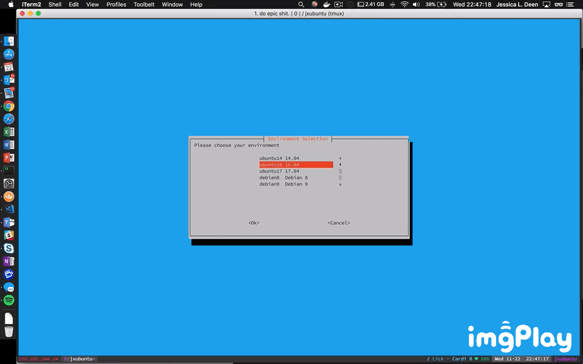

# GUI All-in-One PowerShell Core Installer
[Unofficial] PowerShell Core Install Scripts

To use, run from your terminal:

```
bash -c "$(curl -fsSL https://raw.githubusercontent.com/jldeen/pwshcore/dev/install.sh)"
```
Currently supported distros:
- Ubuntu 14
- Ubuntu 16
- Ubuntu 17
- Debian 8
- Debian 9
- RHLE 7
- CentOS 7
- OpenSUSE 42

### OpenSUSE Disclaimer
Note: As of 12/27/17 OpenSUSE 42 is now supported. However, unlike the other supported distros, this version installs pwshcore via __direct download__. Until the repo version is officially supported without any human interaction, this script will install PowerShell Core using the direct download method. 

This means to remove PowerShell Core from OpenSUSE 42 when installed using this installer you must run the following commands:

```
sudo rm -rf /opt/microsoft/powershell/
sudo rm /usr/bin/pwsh
sudo sed -i '\|^/usr/bin/pwsh|d' /etc/shells
```


### Full blog post available on my blog [jessicadeen.com](http://jessicadeen.com/linux/powershell-core-master/)
### Master [PowerShell Core GitHub](https://github.com/PowerShell/PowerShell) 